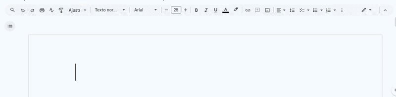
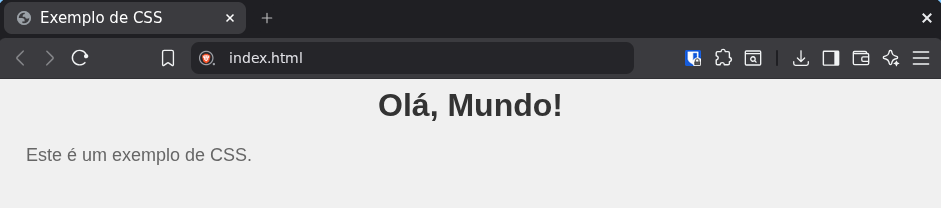
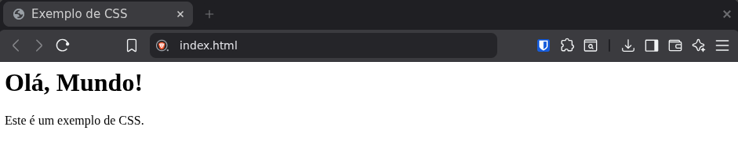
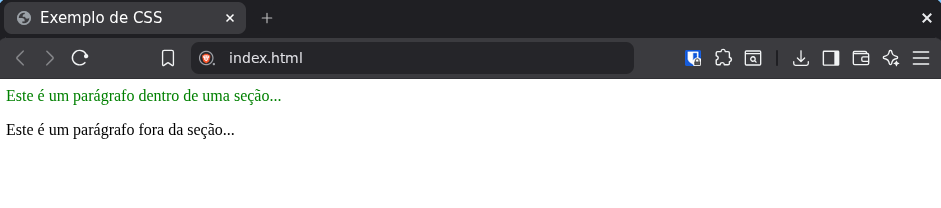

# Aula de webdesign, Turma IA26
Esta disciplina foca na aprendizagem de técnicas e práticas de web design. Com foco nas linguagens de marcação (HTML), de estilo (CSS) e com uma breve introdução à programação com JavaScript. O objetivo é capacitar os alunos a criar e personalizar páginas da web, a construir interfaces virtuais e a compreensão dos princípios de design. Essa é uma disciplina introdutória e fundamental para desenvolver uma base necessária para desenvolver sites e aplicativos mais complexos no futuro. O curso é projetado para ser acessível a iniciantes.

## Antes do início
É desejável que os alunos tenham um ambiente de desenvolvimento configurado em suas máquinas, incluindo um editor de código e um navegador digital atualizado. Nesta disciplina, utilizaremos o Visual Studio Code como editor de código (por ser gratuito e o pasdrão no mercado) e o Google Chrome como navegador digital pelos mesmos motivos.

# HTML - HyperText Markup Language (Linguagem de Marcação de Hipertexto)
Como talvez você possa ter imaginado, HTML não é uma linguagem de programação, mas sim uma linguagem de marcação. Ele serve para organizar e estruturar o conteúdo de uma página (textos, imagens, links, entre outros). Isso é interpretado como uma estrutura visual. No entanto, por o HTML ser responsável por organizar o conteúdo de uma página na internet, é importantíssimo que a estrutura possa ser acessível por todo tipo de usuário, incluindo aqueles com deficiências. Portanto, a estrutura do HTML é fundamental para a acessibilidade e usabilidade de um site. O HTML é composto por uma série de elementos, cada um representado por uma tag (etiqueta) que define o tipo de conteúdo e sua função na página. Por exemplo, `<h1>` é usado para títulos principais, `
` para parágrafos,  para links, entre outros. O HTML também permite a inclusão de atributos nas tags para fornecer informações adicionais sobre os elementos, como class, id, src, etc.
Como talvez você possa ter imaginado, HTML não é uma linguagem de programação, mas sim uma linguagem de marcação. Ele serve para organizar e estruturar o conteúdo de uma página (textos, imagens, links, entre outros). Isso é interpretado como uma estrutura visual. No entanto, por o HTML ser responsável por organizar o conteúdo de uma página na internet, é importantíssimo que a estrutura possa ser acessível por todo tipo de usuário, incluindo aqueles com deficiências. Portanto, a estrutura do HTML é fundamental para a acessibilidade e usabilidade de um site. O HTML é composto por uma série de elementos, cada um representado por uma tag (etiqueta) que define o tipo de conteúdo e sua função na página. Por exemplo, `<h1>` é usado para títulos principais, `
` para parágrafos, `<a>` para links, etc. O HTML também permite a inclusão de atributos nas tags que dão informações extras sobre os elementos, como a origem de uma imagem (`<src>`) ou um link de destino (`<href>`).

Antes de seguirmos, imagine um editor de texto como o Microsoft Word ou o Google Docs. Em editores como esses, você costuma selecionar um trecho de texto e aplicar uma personalização, como negrito, itálico ou sublinhado. O HTML é a linguagem que permite marcar o trecho selecionado com uma tag (etiqueta) que indica a personalização desejada. No HTML, você faz isso usando etiquetas de abertura e fechamento, as etiquetas possuem os símbolos "<>" para indicar o que é uma tag. Um exemplo: Para criar um parágrafo em HTML, você usaria a tag `
` para abrir o parágrafo e `
` para fechá-lo. O conteúdo do parágrafo seria colocado no meio essas duas tags.

 ## Animação de seleção
 

Imagine você escrevendo em um editor a frase "lorem ipsum dolor sit amet potentia" e, então, executa algumas personalizaçôes na frase, como colocando ela em negrito, itálico, ou trocando a cor. Agora veja como seria essas estilizações no HTML:

### Você quer selecionar "lorem ipsum" e coloca em negrito:
Em HTML, o código correspondente seria: "`<strong>`lorem ipsum`</strong>` dolor sit amet potentia", onde a tag `<strong>` é usada para indicar que o texto deve ser exibido em negrito. No exemplo, a marcação começa com a tag `<strong>` e termina com a tag de fechamento `</strong>`, indicando que o texto entre essas tags vai ser exibido em negrito.

### Você agora seleciona "sit amet" e coloca em itálico:
Em HTML, o código correspondente seria: "`<strong>`lorem ipsum`</strong>` dolor `<em>`sit amet`</em>` potentia" A tag `<em>` é usada para indicar que o texto deve ser exibido em itálico. No exemplo, a marcação começa com a tag `<em>` e termina com a tag de fechamento `</em>`, indicando que o texto entre essas tags deve ser exibido em itálico.

### Você seleciona "ipsum dolor sit" e aplica a cor vermelha:
Em HTML, o código correspondente seria: "`<strong>`lorem ``ipsum dolor sit```</strong>` amet `<em>`sit amet`</em>` potentia", onde a tag `` é usada para aplicar estilos específicos a um trecho de texto, e o atributo "style" é usado para definir a cor do texto. No exemplo, a marcação com a tag `` começa antes de ipsum e termina após sit, indicando que o texto entre essas tags deve ser exibido em vermelho. E também começa e termina dentro da tag `<strong>`, tags desse tipo podem se "sobrepor" uma sobre as outras tranquilamente, podendo começar dentro e terminar fora e vice-versa sem anular uma ás outras.

- ⚠️ Nota:
O HTML é uma linguagem de marcação, e seu principal objetivo é estruturar o conteúdo de uma página web. Caso pesquise na internet, notará que existem outras tags para aplicar personalizações como negrito e itálico, como `<b>` e `<i>` respectivamente. Entretanto, as tags `<strong>` e `<em>` são consideradas mais semânticas, pois indicam a importância do texto tanto visualmente quanto para leitores de tela, enquanto as tags `<b>` e `<i>` são puramente de estilização visual. Portanto, é recomendado usar as tags semânticas para melhorar a acessibilidade e a compreensão do conteúdo.

Esta é a sintaxe básica do HTML, e existem muitas outras tags e atributos que podem ser usados para criar páginas web mais complexas e interativas. A sugestão de como aprender HTML é desenhar a estrutura de uma página web em um papel, identificando os diferentes elementos e suas relações, sempre se perguntando qual tag HTML seria mais adequada para representar cada elemento. Em seguida, você pode começar a escrever o código HTML correspondente, usando as tags apropriadas para estruturar o conteúdo da página. Lembre-se de que a prática é fundamental para aprender HTML, então experimente criar diferentes tipos de páginas web e explore as diversas tags e atributos disponíveis.

Ao final deste conteúdo, faremos um exercício prático para aplicar os conceitos aprendidos sobre HTML, onde você terá a oportunidade de criar uma página web simples, aplicando corretamente as tags HTML para estruturar o conteúdo de forma semântica e acessível. Este exercício ajudará a consolidar seu entendimento sobre a sintaxe do HTML e a importância de usar as tags apropriadas para cada tipo de conteúdo.

## Estrutura básica de um documento HTML
Outro ponto importante a ser abordado é a estrutura básica de um documento HTML. Todo documento HTML deve começar com a declaração do tipo de documento `<!DOCTYPE html>`, que informa ao navegador que o documento é um arquivo HTML5. Em seguida, o documento é estruturado em duas partes principais: o `<head>` e o `<body>`.

O `<head>` é a seção do documento onde são incluídas informações sobre a página, como o título, links para arquivos CSS, scripts JavaScript, meta tags (metainformações), entre outros. O conteúdo do `<head>` não é exibido diretamente na página, mas é essencial para o funcionamento e a aparência da página web.

O `<body>` é a seção do documento onde o conteúdo visível da página é colocado. É aqui que você adiciona os elementos HTML que compõem a estrutura e o conteúdo da página, como títulos, parágrafos, imagens, links etc. O conteúdo do `<body>` é o que os usuários veem quando acessam a página web.

### A estrutura básica de um documento HTML pode ser representada da seguinte forma:

<pre>
<code>
&lt;!DOCTYPE html&gt;
&lt;html lang="pt-BR"&gt;
&lt;head&gt;
   &lt;meta charset="UTF-8"&gt;
   &lt;title&gt;Título da Página&lt;/title&gt;
   <!-- Links para arquivos CSS e scripts JavaScript podem ser adicionados aqui -->
&lt;/head&gt;
&lt;body&gt;
   <!-- Conteúdo visível da página é adicionado aqui -->
&lt;/body&gt;
&lt;/html&gt;
</code>
</pre>

- ⚠️ Nota:
Todo o código HTML deve ser escrito dentro da tag "`<html>`", que é a raiz do documento. O atributo "lang="pt-BR" indica que o idioma principal do conteúdo da página é o português do Brasil, o que é importante para a acessibilidade e para os mecanismos de busca entenderem o idioma da página. O elemento "`<meta charset="UTF-8">`" define a codificação de caracteres do documento como UTF-8, garantindo que caracteres acentuados e outros símbolos sejam exibidos corretamente. O elemento "`<title>`" define o título da página, que é exibido na aba do navegador e nos resultados de busca.

## Atributos HTML
Os atributos HTML são usados para dar informações extras sobre os elementos HTML. Eles são escritos dentro da tag de abertura de um elemento e consistem em um nome e um valor, separados por um sinal de igual =. Os atributos podem ser usados para definir propriedades específicas de um elemento, como sua aparência, comportamento ou funcionalidade. Por exemplo, o atributo href é usado em uma tag `<a>` para especificar o URL de destino de um link, enquanto o atributo src é usado em uma tag `` para especificar a fonte da imagem. Os atributos são essenciais para personalizar e controlar o comportamento dos elementos HTML, permitindo que você crie páginas na web mais interativas e dinâmicas.

Imagine que temos a necessidade de criar um link para o site do Google em uma página web. Para isso, podemos usar a tag `<a>` (âncora) e o atributo href para especificar o URL do Google. O código HTML correspondente seria:

`<a href="https://www.google.com">Visite o Google</a>`
O que resultaria em um link clicável com o texto "Visite o Google". Quando o usuário clicasse nesse link, ele seria redirecionado para a página do Google. O atributo href é fundamental para criar links em HTML, e seu valor deve ser um URL válido para garantir que o link funcione corretamente, como é possível ver no resultado abaixo:

<a href="https://www.google.com">Visite o Google</a>

## Lista de todas as tags HTML
Nestes links, você pode encontrar uma lista completa de todas as tags HTML, juntamente com suas descrições e exemplos de uso: <a href="https://developer.mozilla.org/pt-BR/docs/Web/HTML/Reference/Elements">MDN Web Docs - Elementos HTML</a> ou <a href="https://www.w3schools.com/TAGS/default.asp">W3Schools - HTML Tags.</a>

# CSS - Cascading Style Sheets (Folhas de Estilo em Cascata)
O CSS é uma linguagem de estilo usada para definir a aparência e o layout de uma página. Com ele é possível que você controle regras de estilo para os elementos HTML, como cores, fontes, margens, espaçamento, entre outros. O CSS é separado do HTML, o que significa que você pode manter a estrutura do conteúdo (HTML) separada da apresentação visual (CSS). Isso torna o código mais organizado e facilita a manutenção do site. O CSS é composto por seletores e declarações. Os seletores são usados para selecionar os elementos HTML aos quais as regras de estilo serão aplicadas, enquanto as declarações definem as propriedades de estilo e seus valores. Veja o exemplo abaixo:

Considere o seguinte código HTML:
<pre>
<code>
&lt;!DOCTYPE html&gt;
&lt;html lang="pt-BR"&gt;
&lt;head&gt;
   &lt;meta charset="UTF-8"&gt;
   &lt;title&gt;Exemplo de CSS&lt;/title&gt;
   &lt;link rel="stylesheet" href="styles.css"&gt;
&lt;/head&gt;
&lt;body&gt;
   &lt;h1&gt;Olá, Mundo!&lt;/h1&gt;
   &lt;p&gt;Este é um exemplo de CSS.¨&lt;/p&gt;
&lt;/body&gt;
&lt;/html&gt;
</code>
</pre>

Nesse exemplo, temos um documento de HTML básico com um título e um parágrafo. O arquivo CSS externo "styles.css" é vinculado ao documento HTML usando a tag `<link>` no `<head>`. O conteúdo do arquivo "styles.css" pode ser o seguinte:

<pre>
<code>
/* styles.css */
body {
  background-color: #f0f0f0;
  font-family: Arial, sans-serif;
}

h1 {
  color: #333333;
  text-align: center;
}

p {
  color: #666666;
  font-size: 18px;
  margin: 20px;
}
</code>
</pre>

- ⚠️ Nota:
No exemplo acima, o CSS é aplicado ao HTML, pois o arquivo "styles.css" está vinculado ao documento HTML usando a tag `<link>` no `<head>`. O CSS define o estilo para o elemento `<body>`, o título `<h1>` e o parágrafo `
`, controlando a aparência da página web. O CSS é uma parte essencial do desenvolvimento web, pois permite que você crie páginas visualmente atraentes e responsivas, melhorando a experiência do usuário.

O resultado do exemplo acima seria uma página web com um fundo cinza claro, um título centralizado em cor escura e um parágrafo com uma cor mais clara, tamanho de fonte maior e margens ao redor do texto. O CSS é uma ferramenta muito útil para personalizar a aparência de uma página web e criar designs únicos e atraentes.

Com CSS aplicado:

## CSS Aplicado
Sem o CSS, a página web seria exibida com o estilo padrão do navegador, que pode variar dependendo do navegador e do sistema operacional. Chamamos isso de "user agent stylesheet", que é o estilo padrão aplicado pelo navegador aos elementos HTML. O CSS permite que você substitua esse estilo padrão e crie uma aparência personalizada para a sua página, controlando aspectos como cores, fontes, layout, espaçamento, entre outros. Sem o CSS, a página seria exibida de forma básica e sem estiliuzação, o que pode resultar em uma experiência de usuário menos atraente e menos profissional.

Sem CSS aplicado:

## Sintaxe do CSS
A sintaxe do CSS é composta por regras de estilo, onde cada regra é formada por um seletor e um bloco de declarações. O seletor é usado para selecionar os elementos HTML aos quais as regras de estilo serão aplicadas, enquanto o bloco de declarações define as propriedades de estilo e seus valores. A sintaxe básica do CSS pode ser representada da seguinte forma:

<pre>
<code>
seletor {
  propriedade: valor;
  propriedade: valor;
  /* ... */
}
</code>
</pre>

- ⚠️ Nota:
O seletor pode ser um nome de elemento HTML, uma classe, um ID ou uma combinação desses. As propriedades de estilo são palavras-chave que definem o aspecto visual dos elementos, como color, font-size, background-color etc. Os valores são atribuídos às propriedades para especificar o estilo desejado, como red, 16px, #f0f0f0 etc. Cada declaração dentro do bloco de declarações deve ser separada por um ponto e vírgula ;, e o bloco de declarações deve ser encerrado com uma chave `}`.

## Seletores CSS
Os seletores CSS são usados para selecionar os elementos HTML aos quais as regras de estilo serão aplicadas. A lógica dos seletores é baseada na estrutura do documento HTML (seguindo a hierarquia de elementos, por isso o nome "cascading" — em cascata), e eles permitem que você aplique estilos a elementos específicos ou a grupos de elementos com base em suas características, como tipo, classe, ID, atributos, entre outros.

Considere o seguinte código HTML:

<pre>
<code>
&lt;!DOCTYPE html&gt;
&lt;html lang="pt-BR"&gt;
&lt;head&gt;
   &lt;meta charset="UTF-8"&gt;
   &lt;title&gt;Exemplo de Seletores CSS&lt;/title&gt;
   &lt;link rel="stylesheet" href="styles.css"&gt;
&lt;/head&gt;
&lt;body&gt;
   &lt;h1 class="titulo"&gt;Título Principal&lt;/h1&gt;
   &lt;p id="paragrafo1"&gt;Este é o primeiro parágrafo.&lt;/p&gt;
   &lt;p id="paragrafo2"&gt;Este é o segundo parágrafo.&lt;/p&gt;
   &lt;a href="#" class="link"&gt;Este é um link&lt;/a&gt;
&lt;/body&gt;
&lt;/html&gt;
</code>
</pre>
Para aplicar estilos a esses elementos usando CSS, podemos usar diferentes tipos de seletores. Por exemplo:

Seletor de tipo: para selecionar todos os elementos de um determinado tipo, como `<h1>`, `
`, `<a>` etc. Exemplo: `h1 { color: blue; }` aplicaria a cor azul a todos os elementos `<h1>` na página.

Seletor de classe: para selecionar elementos com uma classe específica. Exemplo: `.titulo { font-size: 24px; }` aplicaria um tamanho de fonte de 24 pixels a todos os elementos com a classe "titulo".

Seletor de ID: para selecionar um elemento com um ID específico. Exemplo: `#paragrafo1 { color: red; }` aplicaria a cor vermelha apenas ao elemento com o ID "paragrafo1".

Seletor de atributo: para selecionar elementos com um atributo específico ou um valor de atributo específico. Exemplo: `a[href="#"] { text-decoration: none; }` removeria o sublinhado de todos os links que têm um atributo href com o valor "#".

Pseudo-classes: para selecionar elementos com base em seu estado ou posição na hierarquia do documento. Exemplo: `p:first-child { font-weight: bold; }` aplicaria negrito ao primeiro parágrafo dentro de seu elemento pai.

Como dito, a hierarquia dos elementos HTML é fundamental para entender como os seletores CSS funcionam, pois eles seguem a estrutura do documento para aplicar estilos. Considere um parágrafo que, por sua vez, está dentro de uma seção, que, por sua vez, está dentro do conteúdo principal da página. No HTML, isso seria algo como:

<pre>
<code>
&lt;main&gt;
  &lt;section&gt;
   &lt;p&gt;Este é um parágrafo dentro de uma seção...&lt;/p&gt;
  &lt;/section&gt;
&lt;/main&gt;
</code>
</pre>

Para selecionar e estilizar os parágrafos dentro dessa estrutura, você poderia usar um seletor de descendente como main section p { color: green; }, que aplicaria a cor verde a todos os parágrafos que estão dentro de uma seção, que, por sua vez, está dentro do elemento principal `<main>`. Isso demonstra como os seletores CSS seguem a hierarquia dos elementos HTML para aplicar estilos de forma específica e direcionada.

- ⚠️ Nota:
Os espaços entre os seletores indicam uma relação de descendência, ou seja, o seletor main section p seleciona todos os elementos `
` que são descendentes de um elemento `<section>`, que por sua vez é um descendente de um elemento `<main>`. Isso permite que você aplique estilos de forma mais específica, garantindo que apenas os elementos desejados sejam afetados pelas regras de estilo.

Se, no HTML que usamos de exemplo, tivéssemos um parágrafo fora da seção, como:

<pre>
<code>
&lt;main&gt;
  &lt;section&gt;
   &lt;p&gt;Este é um parágrafo dentro de uma seção...&lt;/p&gt;
  &lt;/section&gt;
  &lt;p&gt;Este é um parágrafo fora da seção...&lt;/p&lt;
&lt;/main&gt;
</code>
</pre>

O seletor "main section p" aplicaria a cor verde apenas ao parágrafo dentro da seção, enquanto o parágrafo fora da seção não seria afetado por essa regra de estilo. Isso demonstra como os seletores CSS permitem que você controle a aplicação de estilos com base na hierarquia dos elementos HTML, garantindo que apenas os elementos desejados sejam estilizados de acordo com as regras definidas.

Resultando em algo como:

## Seletores CSS
Tipos de Seletores CSS
Existem vários tipos de seletores CSS que permitem selecionar elementos HTML de diferentes maneiras. Abaixo está uma tabela com alguns dos tipos de seletores mais comuns. Esta tabela tem o intuito de servir como um guia rápido para entender os diferentes tipos de seletores CSS e como eles funcionam. No entanto, existem muitos outros tipos de seletores CSS; abordaremos esses outros tipos em conteúdos futuros. Por enquanto, foque em entender os tipos de seletores mais comuns listados abaixo, pois eles são os mais utilizados e fundamentais para o aprendizado do CSS.

| Tipo de seletor |Exemplo | Descrição |
| -------- | -------- | -------- |
| Seletor de Tipo   | `nome_elemento { }`   | Seleciona todos os elementos de um determinado tipo. Exemplo: `p { color: blue; }` seleciona todos os parágrafos e aplica a cor azul.   |
| Seletor de Classe   | `.nome_classe { }`   | Seleciona elementos com uma classe específica. Exemplo: .titulo { font-size: 24px; } seleciona todos os elementos com a classe "titulo" e aplica um tamanho de fonte de 24 pixels.   |
| Seletor de ID   | `#nome_id { }`   | Seleciona um elemento com um ID específico. Exemplo: `#paragrafo1 { color: red; }` seleciona o elemento com o ID "paragrafo1" e aplica a cor vermelha.   |
| Seletor de Atributo   | `elemento[atributo="valor"] { }`   | DSeleciona elementos com um atributo específico ou um valor de atributo específico. Exemplo: `a[href="#"] { text-decoration: none; }` seleciona todos os links que têm um atributo href com o valor "#" e remove o sublinhado.   |
| Pseudo-classes   | `elemento:pseudo-classe { }`   | Seleciona elementos com base em seu estado ou posição na hierarquia do documento. Exemplo: p:first-child { font-weight: bold; } seleciona o primeiro parágrafo dentro de seu elemento pai e aplica negrito.   |

Seletores de descendentes, filhos e irmãos:
| Tipo de Seletor | Exemplo | Descrição |
| -------- | -------- | -------- |
| Seletor de Descendente   | `elemento1 elemento2 { }`   | Seleciona elementos que são descendentes de um elemento específico. Exemplo: `main section p { color: green; }` seleciona todos os parágrafos que estão dentro de uma seção, que por sua vez está dentro do elemento principal <main>, e aplica a cor verde.   |
| Seletor de Filho   | `elemento1 > elemento2 { }`   | Seleciona elementos que são filhos diretos de um elemento específico. Exemplo: `main > section { background-color: lightgray; }` seleciona todas as seções que são filhos diretos do elemento principal <main> e aplica um fundo cinza claro.   |
| Seletor de Irmão Adjacente   | `elemento1 + elemento2 { }`   | Seleciona um elemento que é imediatamente precedido por outro elemento específico. Exemplo: `h1 + p { margin-top: 0; }` seleciona o parágrafo que vem imediatamente após um título <h1> e remove a margem superior.   |
| Seletor de Irmão Generalizado   | `elemento1 ~ elemento2 { }`   | Seleciona elementos que são irmãos de um elemento específico, independentemente de sua posição. Exemplo: `h1 ~ p { color: gray; }` seleciona todos os parágrafos que são irmãos de um título <h1> e aplica a cor cinza.   |